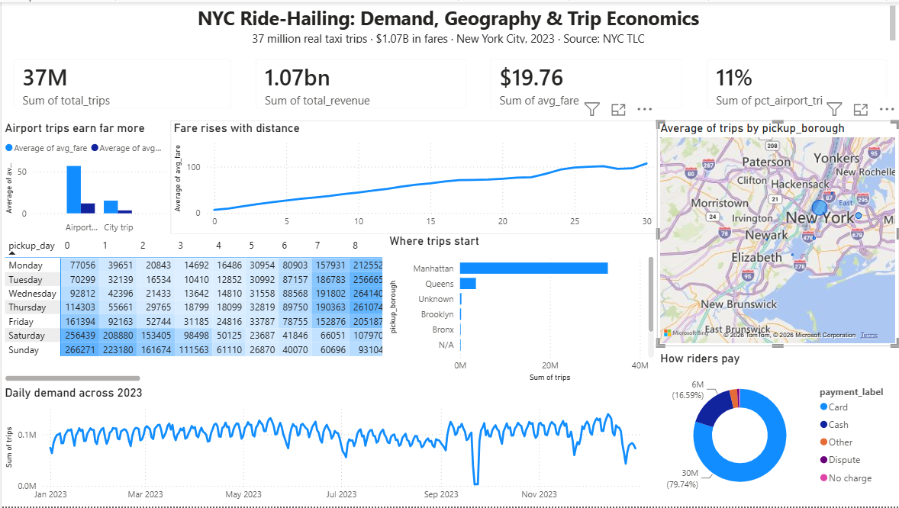

# NYC Urban Mobility: Demand, Timing & Trip Economics

**When and where is ride demand highest, what makes a trip profitable, and how should
we position drivers and price trips to maximise earnings?**
An analysis of **tens of millions of real New York City taxi trips**.



---

## 🎯 Objective & outcome

**Objective —** give a ride-hailing / taxi operator a data-driven answer to **WHEN** demand
peaks, **WHERE** it concentrates, and what drives **trip value** — so it can position drivers
and price trips instead of guessing.

**What this project does —** cleans and aggregates **37M+ real NYC taxi trips (full-year
2023)** entirely on a laptop using **DuckDB** SQL, exports compact summary tables, and presents
demand timing, geographic hotspots, and trip economics in a **Power BI** dashboard with a
concrete recommendation.

**Did we achieve it? ✅ Yes.** From **37.0M cleaned trips ($1.07B revenue)** we found that
**airport trips earn ~3.8× the fare of city trips ($54.95 vs $14.46)**, that Manhattan drives
*volume* while Queens (JFK) drives *value*, and turned it into a driver-positioning +
peak-timing strategy — all backed by a one-page dashboard.

---

## The brief (business context)

> A ride-hailing / taxi operator is scaling up in New York City. With thousands of
> drivers and limited hours in a day, leadership needs to stop guessing and use data to
> answer three operational questions:
>
> 1. **WHEN** is demand highest — which hours, days, and seasons should drivers work?
> 2. **WHERE** is demand concentrated — which zones and boroughs, and how do airports
>    and business districts compare?
> 3. **MONEY** — what drives a high-value trip (distance, time, location, tips), and
>    where are drivers leaving money on the table?

As the analyst, the questions I set out to answer:

1. What do demand patterns look like across **hour-of-day, day-of-week, and month**?
2. Which **pickup zones and boroughs** generate the most trips and the most revenue?
3. How do **airport trips** differ from city trips (value, distance, tipping)?
4. What is the **economics of a trip** — fare vs distance vs duration — and what drives tips?
5. **Recommendation:** a driver-positioning + peak-timing strategy, with the quantified
   revenue upside of focusing on the best zone/time windows.

---

## Data source

| | |
|---|---|
| **Source** | [NYC Taxi & Limousine Commission (TLC) Trip Record Data](https://www.nyc.gov/site/tlc/about/tlc-trip-record-data.page) — official NYC government data |
| **Access** | Public Parquet files, no key required. Downloaded reproducibly via `scripts/01_download_data.py` |
| **Scope** | **Yellow Taxi** trips, full year **2023** (~38 million trips) + official Taxi Zone lookup (265 zones) |
| **Why this source** | Authoritative, government-published, massive scale, transparent. Real operational data — exactly what a mobility company analyses internally. No synthetic/toy data. |

### Data dictionary (key columns)

| Column | Meaning |
|---|---|
| `tpep_pickup_datetime` | When the meter started (trip start) |
| `tpep_dropoff_datetime` | When the meter stopped (trip end) |
| `passenger_count` | Number of passengers |
| `trip_distance` | Trip distance in miles |
| `PULocationID` / `DOLocationID` | Pickup / dropoff TLC zone ID (joins to the zone lookup) |
| `payment_type` | 1 = card, 2 = cash, … |
| `fare_amount` | Base meter fare |
| `tip_amount` | Tip (card trips only — cash tips aren't recorded) |
| `tolls_amount` | Tolls paid |
| `total_amount` | Total charged to the rider |
| `airport_fee` | Surcharge applied at airports |

**Taxi Zone lookup:** `LocationID`, `Borough`, `Zone`, `service_zone` — turns the numeric
zone IDs into real neighbourhood and borough names for the geographic story.

**Key concepts a reviewer will expect me to know:**
- **Trips are recorded per ride**, not per person — demand = trip counts.
- **Cash tips are not recorded** — tip analysis is valid only for card payments.
- **Data is messy at scale**: zero-distance trips, negative fares, impossible timestamps,
  and out-of-range dates all appear and must be cleaned with documented rules.

---

## Technical approach

Because this is **~38 million rows** (far beyond Excel, and slow for plain pandas), the
heavy lifting uses **DuckDB** — a free analytics database that runs standard SQL directly
over Parquet files and aggregates tens of millions of rows in seconds on a laptop. The
analysis SQL then produces small, clean, **Power-BI-ready summary tables**.

```
raw Parquet (38M trips)  ->  DuckDB (clean + aggregate with SQL)  ->  small summary tables  ->  Power BI dashboard
```

**Build strategy:** the pipeline is developed and validated on **one month** first, then
scaled to the **full year** — the same way real production pipelines are built.

---

## Project structure

```
.
├── README.md                       <- the brief, data dictionary & approach
├── data/
│   ├── raw/                         <- TLC Parquet files (NOT committed; large) + zone lookup
│   └── processed/                   <- 8 small, clean, analysis-ready summary tables
├── scripts/
│   ├── 01_download_data.py          <- reproducible download of TLC trip data + zone lookup
│   ├── 02_build_database.py         <- DuckDB: clean + feature-engineer into nyc_mobility.db
│   └── 03_build_analysis_tables.py  <- DuckDB: export the Power-BI-ready summary tables
├── powerbi/                         <- the interactive dashboard (.pbix)
└── dashboard.png                    <- dashboard preview (shown above)
```

## How to reproduce

```bash
# one-time setup
python -m venv .venv && source .venv/bin/activate    # Windows: .venv\Scripts\activate
pip install -r requirements.txt

python scripts/01_download_data.py        # downloads TLC Parquet + zone lookup -> data/raw/
python scripts/02_build_database.py       # DuckDB clean + features -> data/processed/nyc_mobility.db
python scripts/03_build_analysis_tables.py # exports the 8 summary CSVs -> data/processed/
```
> The download script has a `TEST_MODE` flag — start with one month, then switch to the
> full year once the pipeline is validated.

## Progress log
- [x] **Step 1 — Data acquisition.** Reproducible download of TLC Yellow Taxi + zone lookup (`scripts/01_download_data.py`; 1-month test → full-year switch).
- [x] **Step 2 — Clean & model with DuckDB.** `scripts/02_build_database.py` builds `data/processed/nyc_mobility.db` (`trips` + `dim_zone`). Documented cleaning rules (date range, sane distance/fare/duration/speed) kept 96.7% of 38M rows; added time, geography, airport, and payment features.
- [x] **Step 3 — Analysis & insights.** `scripts/03_build_analysis_tables.py` exports 8 Power-BI-ready summary CSVs (demand by hour×day, daily trend, by borough, by zone, airport-vs-city, payment mix, fare-by-distance, KPI summary). Full year: 37M trips, $1.07B in fares; airport trips earn ~3.8× the fare of city trips; JFK is the #1 pickup zone.
- [x] **Step 4 — Power BI dashboard.** Interactive dashboard (`powerbi/NYC Mobility Dashboard.pbix`, preview above): KPI cards, hour×day demand heatmap, borough/zone geography, airport-vs-city economics, and fare-by-distance.
